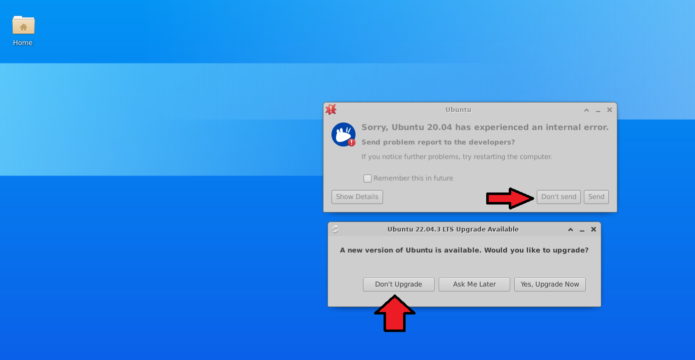

# Introduction

Kamatera is a third party vendor that allows to create a Desktop environment on the cloud. ☁️

It is like your computer in your home, but accesible for everyone and always running.

This comes with a pay per use or a monthly fee. 💲

For servihelper purposes the lowest requeriments are enough.

## Benefits

Its no longer necessary to export and import files, all administrators can work on the same computer with remote access _(but not at the same time)_

## Guide to setup a desktop ubuntu (linux) environment

⚠️ This guide tries to explain the steps for a non expert person but its better to have a higher knowledge.

🕗 It takes about 1 hour to finish the setup.

### Summary of steps

- Create a kamatera account with a billing card.
- Create the desktop from the kamatera dashboard.
- Enter the desktop and create a new user, root _(administrator)_ is not allowed to run servihelper.
- Download servihelper.
- Give executable permissions to execute.

## Create kamatera account

Go to kamatera webpage: https://www.kamatera.com/ and click on Get Started

Click on Create free account:

Click again on create an account:

After setting up the billing process, go to "My Cloud" section and "Create new Desktop" select your region and your closest country.

Select on "Choose Desktop OS" -> UBUNTU

Select the last version:

Select the minimum avaiability, CPU, RAM and storage like in the image, we need at least 20 GB os storage as the system updates itself the first run we dont run out of space:

Set a easy password and a name for the desktop.

Choose the billing strategy, i would recommend go for a fixed tax.

The Task is being done, go for a coffee ☕ _(it takes about 15min)_

After the task is completed, now on Servers section we see our desktop created, click on "Open":

_(If not, refresh the page)_

A new Section appears, we only need the remote connexion details, go to "Info" section:

We have here the remote connection ID, the user and the password:

On Windows, open the application Remote desktop connection:

_(On Mac 🖥️ you can download the app from the app store)_

Put the id, with the dots between the numbers and connect:

This warning is because is a new connection, we need to trust it, click on "do not ask again" and click on "connect":

The same, click on do not ask again and "Yes":

Now we are on the kamatera servers, put the username root and the password we got before:

We are in our remote desktop! Before everything we need to create a new user, thats because servihelper doesnt run with the root _(administrator)_ user.

Open the terminal that its on the bottom bar:

When the terminal is open, we are going to create the new user, write the next lines:

`sudo useradd -m servihelper`

Next we need to add a password, close the console and open it again and write the next lines:

`sudo passwd servihelper`

It will require a password, dont worry if you dont see anything while typing the password, its a security measure:

_(Dont go hard this password will be shared later with other administrators)_

The successful message when the password is set:

Now close the remote connection window, on top right just close the connection, and open again the remote desktop application, now we are going to put the new created user with his password:

Once inside we see some warnings, just skip them all:

Now open the browser, its in the bottom bar right to the terminal we opened before, it will prompt a first run message, just accept and navigate to servihelper: https://github.com/TitoMoi/servihelper

Click on Releases:

Download the latest release, the linux version:

Once downloaded open the folder, right click and "Show in folder" _(its in the download folder)_

Now right click on the downloaded file and click on "Extract Here" it will generate a new folder:

Drag the new created folder to the desktop:

Then open the folder and scroll down until we find the "servihelper.AppImage" _(in the image is just servihelper)_

Right click and click on "Properties"

Go to permission tab and click the bottom check "Allow this file to run as a program"

_(On linux all files are just simple files)_

Close the menu and double click Servihelper.AppImage, it will open servihelper and you are ready to go! 🎉

Now share the adress, the user servihelper and the password with the other administrators so they can connect with the remote desktop application.

🚫 Do not share the kamatera user, its the administrator dashboard and the billing process.

🚫 Do not open whatsapp web or other apps on the remote desktop, copy the generated files to your local machine, just copy, go to your local desktop and paste it.

Remember from time to time to make a copy of servihelper files!
