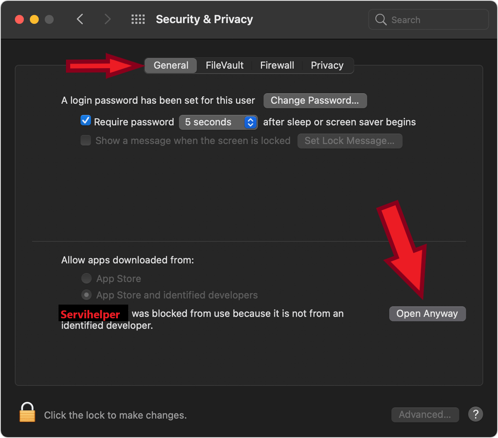
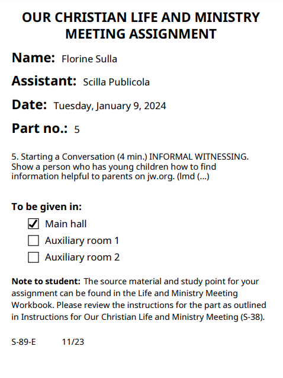
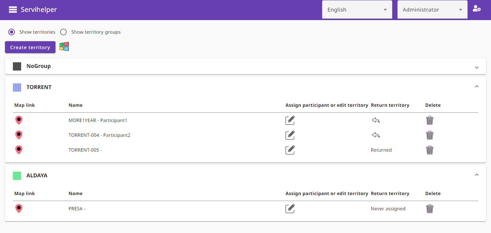
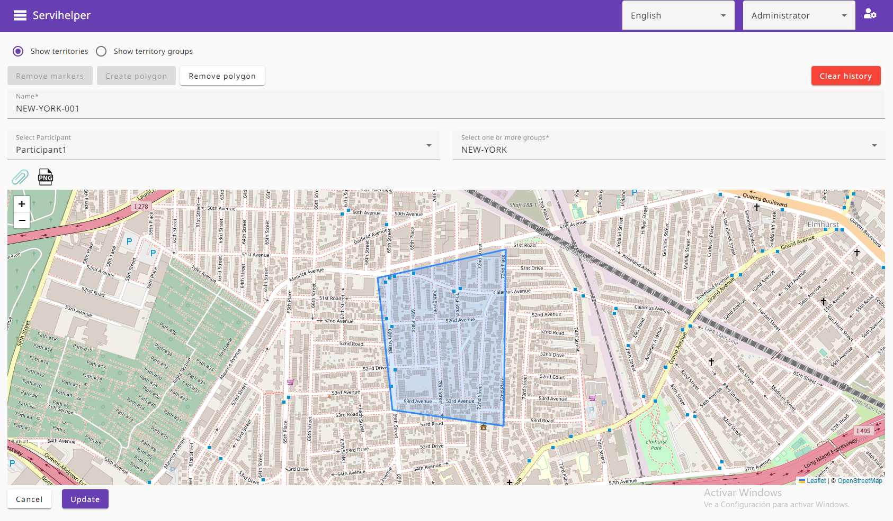
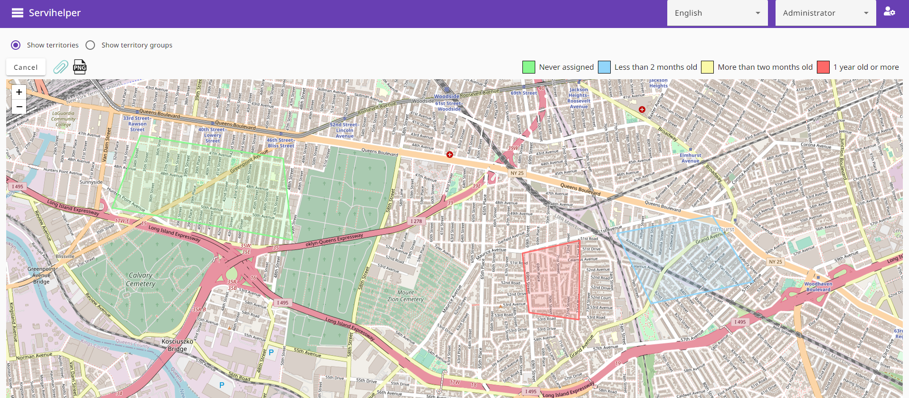

# Introduction

Servihelper is an executable app that runs on the machine _(Windows, Mac or Linux)_

The program is free.

Your data is managed internally on the local device with .json files, so it never goes to the internet.

Its purpose is for help the Jehovah's witnesses to create and manage all kind of assignments.

Also supports territory creation and distribution.

Also supports public speech assignments.

The purpose of servihelper is not to be the best app out there, but to provide a free cost for the user and free cost for the
developer _(Servihelper has no mantainance fee)_ and also provide a very friendly user interface.

## Download links

Download app section: [Download for Windows, Mac or Linux](https://github.com/TitoMoi/servihelper/releases).

## The executable is not recognized on Mac

Thats because i dont have an Apple developer Id _(i have to pay for it)_, you need to trust the binary manually, go to:

mac -> security tab -> general tab and below the section are the instructions to allow it.

More help: [Open a Mac app from an unidentified developer](https://support.apple.com/en-gb/guide/mac-help/mh40616/mac)

## ¿What can be done?

- All kinds of assignments can be created and distributed physically _(print)_ or digitally.
- Create territories and distribute them.

## Example images

Native, general purpose assignment slip:

S89 slip with theme if is return visit or initial call:

## Example images Territory

Overview:

Edition:

Heatmap:

## Languages

Available interface languages are at the end of the page.

The sheet _(assignment)_ to distribute can be customized, so you can add your language when distributing.

## What cannot be done or implemented?

Diferent persons working _at the same time_ and being free is not possible.

But it's possible to work one after another.

Paid mode:
Configure a remote desktop and avoid the need to export and import data manually.

[Guide to configure a remote desktop with kamatera](./KAMATERA.md)

Free mode:

- Export the app data from administrator one and importing in the app of the administrator two.

There is no sync process, all imported files from person one will override the existing ones of person two.

Scenarios for free mode, you can opt the one who suits your team best:

1.  Use built in online mode with a shared folder _(google drive, one drive...)_

- Only required setup of the shared folder.
- Required knowledge of how to install and run google drive _(or other solution)_
- Your responsability to ensure that all files are sync before working.

2.  Only use google drive to share copies of servihelper _(or other solution)_

- No setup of online mode _(easy)_
- Required knowledge of how to install and run google drive.
- Your responsability to ensure that you have the last backup before working.

## ¿Can I distribute it?

Yes, although it is recommended that you distribute the download link, as a new version may have come out with some correction.

## ¿How do I distribute the assignments?

- Digital distribution

  - In the assignments section, an icon sheet appears in the -Image- column. Click, watch the preview and copy to clipboard. Then paste on whatsapp.
  - On report section select "multiple sheets" and click "generate png files" button, it will create a folder for each participant with his assignments in .png format.

- Print - On the reports section select "multiple sheets" there is a print button.

## ¿How do I distribute the territories?

- There is a link that you can distribute for each territory. If you want to short the link before send it you can use some online tool like shortUrl.

## When selecting the participant for the assignment, a number is displayed next to it, what is it?

It is the number of times the participant has participated in that room with that type of assignment with that role _(principal or assistant)_

## ¿How do I report a bug or ask for a feature?

You can use github issues or send me an email to servihelper@gmail.com

## ¿Can it be translated to my language?

Yes, send me the file located on assets/i18n/en.json translated attached by email and the name of the language.

## Im a developer, can i contribute?

Yes, fix, perf, refactor, test and docs are welcome.

### Available languages

- English
- Spanish
- French
- Catalan
- Portuguese
- Italian
- German
- Deutch
- Greek
- Romanian
- Polish
- Turkish
- Russian
- Japanese
- Korean
- Chinese simplified
- Hindi
- Bengali
