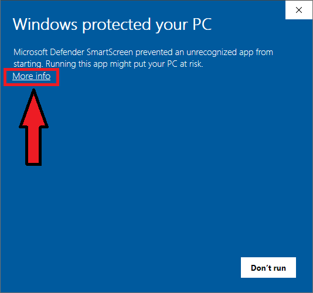

# Introduction

Servihelper is an app that runs on the machine 🖥️ _(Windows, Mac or Linux)_

Does not work on mobile phone 📱 or tablet.

The program is free. 🙅‍♂️💵

Your data is managed internally on the local device with .json and .gz files, so it never goes to the internet.

Its purpose is for help the Jehovah's witnesses to:

- Create and manage all kind of assignments _(Also public speech assignments)_ 📄
- Territory creation and distribution. 🗺️

And also:

- Provide a free cost for the user _(you)_ and a free cost for the developer _(me)_
- ✨ Provide a very friendly user interface ✨

## Download links

Download app section: [Download for Windows, Mac or Linux](https://github.com/TitoMoi/servihelper/releases).

## The executable is not recognized on Mac

Thats because i dont have an Apple developer Id _(i have to pay for it)_, you need to trust the binary manually, go to:

mac -> security tab -> general tab and below the section are the instructions to allow it.

More help: [Open a Mac app from an unidentified developer](https://support.apple.com/en-gb/guide/mac-help/mh40616/mac)

## The executable is not recognized on Windows

The same as Mac, you need to trust the binary manually, when the smart screen appear, confirm that you want to open it:

## Example images

S89 slip:

Native, general purpose assignment slip:

## Example territory images

Overview:

Edition:

Heatmap:

## Languages

Available interface languages are at the end of the page.

In case your language is not supported, you can customize the native slip and the s89 slip with your language in the config section.

Only the time format can't be changed, but you can select a lang that suits your format.

## Benefits and disadvantages of using an offline app

| Offline _(Servihelper)_ vs other online solutions    | Servihelper(offline)                                                                      | Online apps                                                                                                          |
| ---------------------------------------------------- | ----------------------------------------------------------------------------------------- | -------------------------------------------------------------------------------------------------------------------- |
| Free                                                 | Yes                                                                                       | Most yes _(but requires donations to maintain servers and can change in the future)_ and some others you have to pay |
| Immediate update and fixes                           | No _(you need to download new version)_                                                   | Yes                                                                                                                  |
| Multiple administrators at the same time (real time) | No _(works importing and exporting copies, most of the tasks dont really need real time)_ | Yes                                                                                                                  |
| Needs mobile version                                 | No                                                                                        | Some yes _(i see it as overengineering or privacy concerns)_                                                         |
| Can receive web attacks and lose data                | No                                                                                        | Yes                                                                                                                  |
| Privacy                                              | Files are in admin. computer or google drive                                              | Files are encrypted on backend servers                                                                               |
| Restore backups                                      | Just import an old copy                                                                   | Depends on how app admins. do this                                                                                   |

## What cannot be done or implemented?

- Compatibility with other theocratic existing programs is not possible, as i can't guarantee compatibility over time.

- Automate everything.

- Diferent persons working _at the same time_ and being free is not possible.
  But it's possible to work one after another.

## Ways of work with multiple administrators 🧑👨‍🦰🧔

**Free mode**:

- _(The next scenarios 1 and 2 dont have synchronization, all imported copies from person one will override the existing ones of person two)_
- _(Maybe one scenario suits your needs better than the other, it is explained the benefits and the disadvantages)_

1. **Use 'google drive desktop app' _(or other solution)_ to centralize and share copies of servihelper.**

   - Do not enable: config -> online mode.
   - Required knowledge of how to install and run google drive desktop app _(or other desktop solution)_
   - Your responsability to ensure that you have the last backup before working.
   - Import the last backup, work locally and when finished, export a new copy to the shared folder. _(little complexity and a bit of overhead, on finish your work you have to remember to save your backup to the shared folder. **✅ this is the most robust approach and the one i recommend**)_

2. **Export the app data from administrator one and importing in the app of the administrator two sharing the copy through email or whatsapp _(⚠️ not recommended)_**

   - Do not activate: config -> online mode.
   - Do not use shared folder _(google drive or others...)_
   - _(Easy, no complexity but an overhead to understand wich and where is the latest copy)_

3. **Enable built in online mode with a shared folder _(google drive, one drive... ⚠️ also not recommended)_**

   - Enable: config -> online mode _(Required setup inside Servihelper in the config section to configure the shared folder)_
   - Required knowledge of how to install and run google drive desktop app _(or other desktop solution)_
   - Your responsability to ensure that all files are synchronized before working.
   - Warning: Sometimes data is not updated on real time.
   - _(this way of work has configuration complexity but later has less overhead, just check you are online and google drive is working and files are up to date before working)_
   - _(this scenario is not real time, it just works directly with the files instead of with copies, you must export copies from time to time for security)_

**Paid mode 💲**:

_(If money is not a concern, it's better in terms of complexity to use another theocratic online tool instead of configure a server just for servihelper)_

If you want to continue, configure a remote desktop and avoid the need to export and import data manually. This requires a person with medium/advanced skills and a bit of overhead to configure. And also a platform mantainance over time _(⚠️ not recommended)_

[Guide to configure a remote desktop with kamatera](./KAMATERA.md)

## Way to create assignments

Open Servihelper and open jw library app, split the screen between Servihelper and jw library.

First, create participants.

Then on creating the assignment copy the assignment title from jw library and put it on the "theme field":

Then, select the participant/s\* and click the create button _(or create another assignment)_:

\*_The algorithm used to sort the participants is based on participation of that assignment type and then are sorted again by time distance. Also, there is a yellow and red clock helpers to distribute the effort along the year._ This ensures equallity among all the participants, but there are special cases where you need the global participation view.

\*The global view: _Assign participants only by global count _(round robin queue)_ is a **bad measure** and can lead to repeat assignment types just because it's the participant turn. It's better to assign participants by assignment type and then by time distance. This way, the participants will have a more balanced work load. When there are many participants, it's a good idea to increase the 'distance in days clock' _(yellow clock in settings section)\_ that prevents the participant to take another assignment in a long time. Anyway, when creating the assignment you also have the global count option.

The global view ensures faster times to make an assignment but punishes the participant to do diferent assignment types. Use this view wisely.

## Best order to create assignment types based on priority

1. First, create life & ministry assignments.
2. Second, create weekend meeting assignments.
3. Third, create other assignments _(video, audio, etc...)_

## ¿Can I distribute the app?

Yes, although it is recommended that you distribute the download link, as a new version may have come out with some correction or new feature.

## ¿How do I distribute the assignments?

- Digital distribution:

  - In the assignments section, an icon sheet appears in the -Image- column. Click, watch the preview and copy to clipboard or generate the s89 slip.
  - On report section select _"multiple sheets and s89 slips"_ and click "generate png files" button for native slips or click s89 slips, it will create a folder for each participant with his assignments.

- Print:
  - On the reports section select "multiple sheets" there is a print button for the native slips.
  - On generating the s89 slips you can open the pdf and print it.

## ¿How do I distribute the territories?

- There is a link that you can distribute for each territory.
- You can also generate and distribute a pdf file _(more friendly)_

## When selecting the participant for the assignment, a number is displayed next to it, what is it?

It is the number of times the participant has participated in that type of assignment with that role _(principal or assistant)_

The display list is sorted by participation and then is again sorted by time. You can click the _"info"_ blue icon to have more details.

## ¿How do I report a bug or ask for a feature?

You can use github issues or send me an email to servihelper@gmail.com

## ¿Can it be translated to my language?

Yes, send me the file located on assets/i18n/en.json translated attached by email and the name of the language.

### Available languages

- English
- Spanish
- French
- Catalan
- Croatian
- Portuguese
- Italian
- German
- Deutch
- Greek
- Romanian
- Polish
- Turkish
- Russian
- Japanese
- Korean
- Chinese simplified
- Hindi
- Bengali
