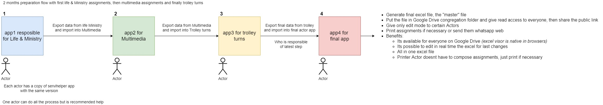

# Introduction

Servihelper is a free executable app that runs on the machine _(Windows or Mac)_

Your data is managed internally on the local device, so it never goes to the internet.

Its purpose is for help the Jehovah's witnesses to create and manage assignments for the meetings.

## Download links

Download app section [Download for Windows or Mac](https://github.com/TitoMoi/servihelper/releases).

## Languages

Available languages are at the end of the page.

## The executable is not recognized on Mac

Thats because i dont have an Apple developer Id, you must need to trust the binary in mac -> security tab -> general tab and below the section are the instructions to allow it.

## ¿What can be done?

All kinds of assignments can be created. You need to create the assignment types, rooms, and participants in advance.

## What cannot be done or implemented?

Diferent actors working at the same time is not possible, as sensitive data cannot be uploaded to cloud environments and keep being free.

But, they can work exporting the app data from actor one and importing in the app of the actor two.

## ¿Can I distribute it?

Yes, although it is recommended that you distribute the download link, as a new version may have come out with some correction.

## ¿How do I distribute the assignments?

When generating an assignment in the -Assignments- section, an assignment sheet appears in the -Image- column.

We click on it and we can preview the assignment.

Then below, we can copy it to the clipboard to later paste it in whatsapp web, generate a .png image or generate a pdf.

Massive printing of assignments is supported too.

## When I create an assignment, when selecting the participant, a number is displayed next to it, what is it?

It is the number of times the participant has participated in that room with that type of assignment with that role.

## ¿How do I report a bug or ask for a feature?

You can use github issues or send me an email to servihelper@gmail.com

## ¿Can it be translated to my language?

Yes, send me the file located on assets/i18n/en.json translated attached by email and the name of the language.

## Im a developer, can i contribute?

Yes, fix, perf, refactor, test and docs are welcome.

### Recommend workflow

### Available languages

- English
- Spanish
- French
- Catalan
- Portuguese
- Italian
- German
- Greek
- Russian
- Japanese
- Korean
- Chinese simplified
- Hindi
- Bengali
